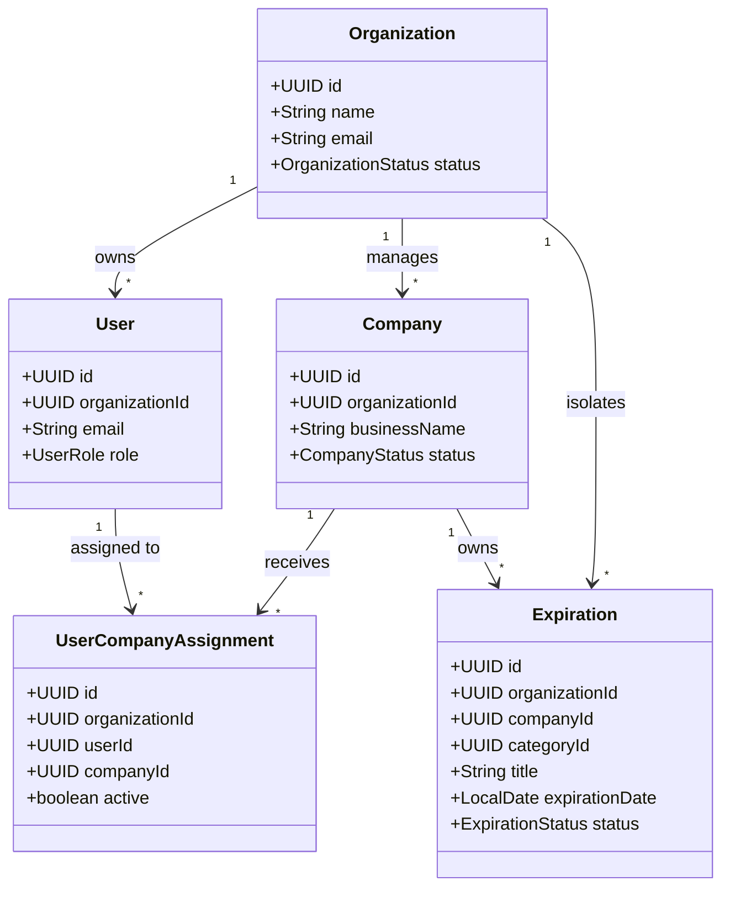

# PREVENIA — Documento de Arquitectura de Software (v0.1)

## 1. Propósito y Visión del Producto
**PREVENIA** es una plataforma web SaaS multi-tenant concebida para consultoras, profesionales y empresas del rubro de **Higiene y Seguridad Laboral**. 

Su núcleo funcional principal es la **gestión centralizada de vencimientos y obligaciones normativas**. En el ámbito industrial y corporativo, una consultora gestiona múltiples empresas clientes, cada una con decenas de obligaciones críticas sujetas a inspecciones, penalizaciones o riesgos civiles y penales:
* Matafuegos y extintores (recargas y pruebas hidráulicas).
* Capacitaciones y simulacros de evacuación obligatorios.
* Cobertura de ART y cláusulas de no repetición.
* Visitas técnicas periódicas y libros de actas.
* Mantenimiento de ascensores y montacargas.
* Habilitación e inspección técnica de autoelevadores.
* Pólizas de seguros de responsabilidad civil y vida.
* Mediciones reglamentarias (puesta a tierra - PAT, ruido, iluminación, contaminantes).
* Habilitaciones comerciales y medioambientales.

---

## 2. Filosofía Arquitectónica: Modular Monolith
Para la etapa fundacional y de escala inicial, se adopta un **Modular Monolith** (Monolito Modular) en lugar de microservicios:

```mermaid
graph TD
    subgraph Browser_Client ["Frontend (Next.js App Router)"]
        UI["Landing / Dashboard UI"]
        State["Feature Services / ApiClient"]
    end

    subgraph Backend_App ["Backend (Spring Boot 3 - Modular Monolith)"]
        subgraph Modules ["Módulos de Dominio"]
            SharedMod["shared (Domain, Config, Errors)"]
            OrgMod["organization (Tenancy)"]
            UserMod["user (Identity & Roles)"]
            CompMod["company (Client Companies)"]
            AssignMod["assignment (Tech to Company)"]
            ExpMod["expiration (Generic Expiration Engine)"]
            SysMod["system (Health & Diagnostics)"]
        end
    end

    subgraph Persistence ["Persistencia"]
        Postgres[(PostgreSQL 16 Multi-Tenant)]
        FlywayMigrations["Flyway Migrations (V1..Vn)"]
    end

    UI -->|REST / JSON (CORS)| Backend_App
    Backend_App --> Persistence
```

### Justificación:
1. **Evita la sobrecarga operacional (Overengineering)** de microservicios (latencia de red, consistencia eventual, transacciones distribuidas, orquestación compleja).
2. **Alta cohesión por dominio**: El código está modularizado por dominio de negocio (`organization`, `user`, `company`, `assignment`, `expiration`, `shared`), facilitando una eventual extracción a microservicios si el volumen de negocio lo justificara en el futuro.
3. **Estructura interna limpia**: Cada módulo implementa una separación lógica (`domain`, `application`, `infrastructure`, `api`) sin caer en dogmatismos excesivos.

---

## 3. Matriz de Roles y Multi-Tenancy

PREVENIA adopta un esquema de **Multi-tenancy por columna (Tenant Discriminator)** en una única base de datos PostgreSQL, garantizando aislamiento estricto mediante claves foráneas y políticas de filtrado por `organization_id`.



### Roles del Sistema:
1. `PLATFORM_ADMIN`: Administrador global de PREVENIA. Capacidad para gestionar consultoras, suscripciones y auditoría global.
2. `CONSULTANT_ADMIN`: Dueño/Administrador de una consultora de Higiene y Seguridad (`Organization`). Administra sus técnicos, clientes, empresas y reglas de vencimientos.
3. `TECHNICIAN`: Profesional de campo. Solo accede a las empresas que tenga asignadas explícitamente vía `UserCompanyAssignment`.
4. `CLIENT`: Usuario corporativo de la empresa cliente (`Company`). Acceso en modo consulta y seguimiento a las obligaciones de su empresa.

---

## 4. Decisiones Técnicas Clave

| Decisión | Elección | Justificación |
|---|---|---|
| **Estrategia de IDs** | `UUID (v4)` | IDs no predecibles ni enumerables. Seguro para URLs de API públicas, evita fugas de información entre tenants y facilita importaciones/exportaciones distribuidas. |
| **Zonas Horarias** | `TIMESTAMPTZ` (UTC) | Almacenamiento universal en UTC (`OffsetDateTime`). La conversión a huso horario local (e.g., `America/Argentina/Buenos_Aires`) se realiza en la capa de presentación. |
| **Control de Migraciones** | `Flyway` | Control de versiones estricto del schema en Git. Hibernate configurado en modo `validate` para evitar derivas no controladas. |
| **Estado de Vencimientos** | Estado Operacional vs Temporal | Se persiste el estado operativo (`PENDING`, `COMPLETED`, `CANCELLED`). Los estados temporales (`VIGENTE`, `PRÓXIMO`, `URGENTE`, `VENCIDO`) se calculan en base a `expirationDate` y la fecha actual para evitar desincronizaciones de datos. |
| **Categorías de Vencimiento** | Tabla Parametrizable Híbrida | Tabla `expiration_categories` con categorías del sistema (`organization_id = NULL`) y categorías personalizadas creadas por consultoras (`organization_id = UUID`). |

---

## 5. Estrategia de Evolución a Cloud (AWS)
Aunque en el Día 1 no se implementa AWS, la arquitectura desacoplada permite adoptar sin fricción:
* **Amazon ECS / EKS**: Despliegue de contenedores Docker de backend y frontend.
* **Amazon RDS PostgreSQL**: Persistencia gestionada con Multi-AZ y backups automáticos.
* **Amazon S3**: Almacenamiento de documentación adjunta a vencimientos (certificados, protocolos, informes).
* **Amazon Cognito / OIDC**: Autenticación delegada mapeable a través del campo `external_identity_id` del usuario.
* **Amazon SES / SNS**: Despacho de notificaciones y alertas automáticas por email/SMS.
