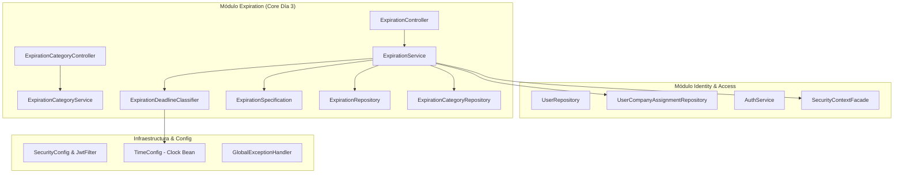

# PREVENIA — Arquitectura del Sistema (v0.3 — Día 3)

## 1. Visión y Principios Arquitectónicos
**PREVENIA** está estructurado como un **Monolito Modular** en Spring Boot (Backend) y Next.js 15 App Router (Frontend).

### Principios Rectores:
1. **Seguridad y Tenancy en Backend**: La base de datos y la capa de servicios son la única fuente de verdad; el frontend refleja únicamente lo que el backend autoriza.
2. **Separación entre Estado Administrativo y Clasificación Temporal**: El ciclo de vida administrativo (`ACTIVE`, `COMPLETED`, `CANCELLED`) se persiste físicamente. La urgencia temporal (`URGENT`, `UPCOMING`, `CURRENT`, `EXPIRED`) se calcula dinámicamente según la fecha actual.
3. **Abstracción del Reloj (`java.time.Clock`)**: Nunca se usa `LocalDate.now()` disperso; el motor inyecta un bean `Clock` configurable (default: `America/Argentina/Buenos_Aires`) que permite testing determinista y simulación temporal.
4. **Consultas Multi-Tenant vía Specifications**: Las consultas no traen listas completas a memoria; `ExpirationSpecification` traduce los scopes de seguridad y filtros en cláusulas SQL `WHERE` eficientes ejecutadas directamente por PostgreSQL.

---

## 2. Diagrama de Módulos Backend



---

## 3. Especificación de Consultas Multi-Tenant (`ExpirationSpecification`)

Para garantizar que un usuario jamás acceda a datos fuera de su ámbito ni mediante filtros maliciosos:

```java
public static Specification<Expiration> forUserScope(AuthenticatedUser user, Set<UUID> assignedCompanyIds) {
    return (root, query, cb) -> {
        if (user.getRole() == UserRole.PLATFORM_ADMIN) {
            return cb.conjunction(); // Sin restricciones de tenant
        }
        if (user.getRole() == UserRole.CONSULTANT_ADMIN) {
            return cb.equal(root.get("organizationId"), user.getOrganizationId());
        }
        if (user.getRole() == UserRole.TECHNICIAN) {
            if (assignedCompanyIds == null || assignedCompanyIds.isEmpty()) {
                return cb.disjunction(); // Bloqueo total si no tiene empresas asignadas
            }
            return cb.and(
                cb.equal(root.get("organizationId"), user.getOrganizationId()),
                root.get("company").get("id").in(assignedCompanyIds)
            );
        }
        if (user.getRole() == UserRole.CLIENT) {
            if (user.getCompanyId() == null) {
                return cb.disjunction();
            }
            return cb.equal(root.get("company").get("id"), user.getCompanyId());
        }
        return cb.disjunction();
    };
}
```

La consulta final se compone con `Specification.where(baseScope).and(userFilters)` garantizando que el alcance autorizado nunca sea sobreescrito.

---

## 4. Endpoints del Core de Vencimientos

| Método | Endpoint | Roles Permitidos | Descripción |
|---|---|---|---|
| `GET` | `/api/v1/expirations` | Todos (Filtrado por rol/tenant) | Listado paginado con filtros por empresa, categoría, fechas y estados. |
| `GET` | `/api/v1/expirations/{id}` | Todos (Scope verificado) | Detalle completo de un vencimiento. Retorna 404 ante accesos no autorizados. |
| `POST` | `/api/v1/expirations` | `PLATFORM_ADMIN`, `CONSULTANT_ADMIN`, `TECHNICIAN` (Asignado) | Crea una nueva obligación técnica. Rechazado con 403 para `CLIENT`. |
| `PUT` | `/api/v1/expirations/{id}` | `PLATFORM_ADMIN`, `CONSULTANT_ADMIN`, `TECHNICIAN` (Asignado) | Actualiza campos editables (título, fechas, notas, responsable). Empresa inmutable. |
| `POST` | `/api/v1/expirations/{id}/complete` | `PLATFORM_ADMIN`, `CONSULTANT_ADMIN`, `TECHNICIAN` (Asignado) | Marca la obligación como `COMPLETED` con fecha y notas de cumplimiento. |
| `POST` | `/api/v1/expirations/{id}/cancel` | `PLATFORM_ADMIN`, `CONSULTANT_ADMIN`, `TECHNICIAN` (Asignado) | Marca la obligación como `CANCELLED` con motivo de cancelación. |
| `DELETE` | `/api/v1/expirations/{id}` | `PLATFORM_ADMIN`, `CONSULTANT_ADMIN`, `TECHNICIAN` (Asignado) | Eliminación lógica / cancelación para preservar auditoría. |
| `GET` | `/api/v1/expirations/upcoming` | Todos (Scope verificado) | Vencimientos activos con fecha entre hoy y los próximos 30 días. |
| `GET` | `/api/v1/expirations/expired` | Todos (Scope verificado) | Vencimientos activos con fecha anterior a hoy. |
| `GET` | `/api/v1/companies/{companyId}/expirations` | Todos (Scope verificado) | Vencimientos de una empresa específica respetando permisos. |
| `GET` | `/api/v1/expiration-categories` | Todos | Listado de categorías disponibles (Globales + Tenant). |
| `POST` | `/api/v1/expiration-categories` | `PLATFORM_ADMIN`, `CONSULTANT_ADMIN` | Alta de nueva categoría (Rechaza códigos duplicados con 409). |

---

## 5. Arquitectura Cloud en AWS (v0.1)

```mermaid
flowchart TD
    subgraph Internet["Tráfico Externo"]
        ClientBrowser["Navegador Web (HTTPS)"]
    end

    subgraph AWS_Cloud["AWS Cloud — Región us-east-1 (N. Virginia)"]
        ACM_TLS["AWS Certificate Manager (TLS / SSL)"]
        
        subgraph EdgeLayer["Edge / Ingress Layer"]
            Route53["Amazon Route 53 (DNS)<br/>app.prevenia.com / api.prevenia.com"]
            CloudFront["Amazon CloudFront (CDN)"]
            ALB["Application Load Balancer (ALB)<br/>(HTTP 80 → Redirect HTTPS 443)"]
        end

        subgraph VPC_Prevenia["prevenia-prod-vpc (10.0.0.0/16)"]
            subgraph Public_Subnets["Subredes Públicas (2 AZs)"]
                ECS_FE["ECS Fargate: prevenia-frontend<br/>Next.js 15 Standalone (Port 3000)<br/>Non-root nextjs user"]
                ECS_BE["ECS Fargate: prevenia-backend<br/>Spring Boot 3.3 (Port 8080)<br/>Non-root prevenia user"]
            end

            subgraph Private_Subnets["Subredes Privadas Aisladas (2 AZs)"]
                RDS_DB["Amazon RDS PostgreSQL 16<br/>db.t4g.micro • gp3 Encrypted<br/>Publicly Accessible: NO (Port 5432)"]
            end
        end

        subgraph Supporting_Services["Servicios de Soporte & Seguridad"]
            ECR["Amazon ECR (Docker Images SHA-tagged)"]
            SSM["SSM Parameter Store (Encrypted Secrets)"]
            CloudWatch["CloudWatch Logs & Alarms (14d Retention)"]
        end
    end

    ClientBrowser --> Route53
    Route53 --> ACM_TLS
    Route53 --> ALB
    ALB -->|"/api/*"| ECS_BE
    ALB -->|"/*"| ECS_FE
    ECS_FE -.->|SSR / API calls| ALB
    ECS_BE -->|Port 5432 (SG Restricted)| RDS_DB
    ECS_BE --> SSM
    ECS_BE --> CloudWatch
    ECS_FE --> CloudWatch
    ECR -.->|Pull Image| ECS_BE
    ECR -.->|Pull Image| ECS_FE
```

