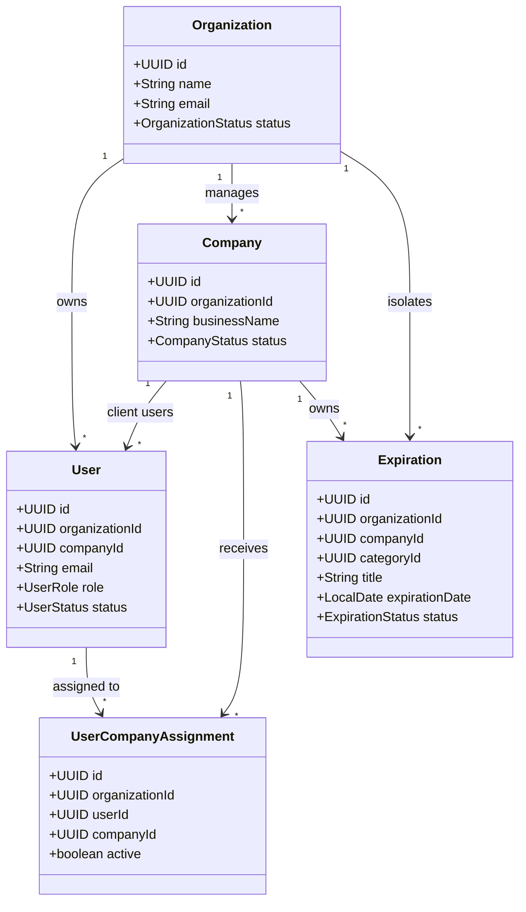

# PREVENIA — Documento de Arquitectura de Software (v0.2 — Día 2)

## 1. Propósito y Visión del Producto
**PREVENIA** es una plataforma web SaaS multi-tenant concebida para consultoras, profesionales y empresas del rubro de **Higiene y Seguridad Laboral**.

Su núcleo funcional principal es la **gestión centralizada de vencimientos y obligaciones normativas**. En el ámbito industrial y corporativo, una consultora gestiona múltiples empresas clientes, cada una con decenas de obligaciones críticas sujetas a inspecciones, penalizaciones o riesgos civiles y penales:
* Matafuegos y extintores (recargas y pruebas hidráulicas).
* Capacitaciones y simulacros de evacuación obligatorios.
* Cobertura de ART y cláusulas de no repetición.
* Visitas técnicas periódicas y libros de actas.
* Mantenimiento de ascensores y montacargas.
* Habilitación e inspección técnica de autoelevadores.
* Pólizas de seguros de responsabilidad civil y vida.
* Mediciones reglamentarias (puesta a tierra - PAT, ruido, iluminación, contaminantes).
* Habilitaciones comerciales y medioambientales.

---

## 2. Filosofía Arquitectónica: Modular Monolith

Para la etapa fundacional y de escala inicial, se adopta un **Modular Monolith** (Monolito Modular) en lugar de microservicios:

```mermaid
graph TD
    subgraph Browser_Client ["Frontend (Next.js 15 App Router)"]
        UI["Landing / Dashboard UI"]
        AuthCtx["AuthContext & Role Guard"]
        ApiClient["ApiClient (Bearer JWT Auto-inject)"]
    end

    subgraph Backend_App ["Backend (Spring Boot 3.3.4 - Modular Monolith)"]
        subgraph SecurityLayer ["Seguridad & Autenticación"]
            SecFilter["JwtAuthenticationFilter (OncePerRequest)"]
            SecConfig["SecurityFilterChain (@EnableMethodSecurity)"]
            SecFacade["SecurityContextFacade (Tenant & Principal Provider)"]
        end

        subgraph Modules ["Módulos de Dominio"]
            AuthMod["auth (Login, JWT, BCrypt)"]
            OrgMod["organization (Tenancy)"]
            UserMod["user (Identity & Roles)"]
            CompMod["company (Client Companies)"]
            AssignMod["assignment (Tech to Company)"]
            ExpMod["expiration (Generic Expiration Engine)"]
            SharedMod["shared (Domain, Config, Error Handling)"]
        end
    end

    subgraph Persistence ["Persistencia"]
        Postgres[(PostgreSQL 16 Multi-Tenant)]
        FlywayMigrations["Flyway (V1 Schema + V2 Seeds & Constraints)"]
    end

    ApiClient -->|REST / JSON (Authorization: Bearer)| SecFilter
    SecFilter --> SecConfig
    SecConfig --> Modules
    Modules --> SecFacade
    Modules --> Persistence
```

### Justificación:
1. **Evita la sobrecarga operacional (Overengineering)** de microservicios (latencia de red, consistencia eventual, transacciones distribuidas, orquestación compleja).
2. **Alta cohesión por dominio**: El código está modularizado por dominio de negocio (`auth`, `organization`, `user`, `company`, `assignment`, `expiration`, `shared`), facilitando una eventual extracción a microservicios si el volumen de negocio lo justificara en el futuro.
3. **Estructura interna limpia**: Cada módulo implementa una separación lógica (`domain`, `application`, `infrastructure`, `api`) sin caer en dogmatismos excesivos.

---

## 3. Modelo de Seguridad y Autenticación (Día 2)

### 3.1 Pipeline de Autenticación Stateless (JWT)
1. **Login (`POST /api/v1/auth/login`)**:
   - Valida credenciales (`email`, `password`) usando `BCryptPasswordEncoder`.
   - Verifica que el usuario se encuentre en estado `ACTIVE`.
   - Genera un token JWT firmado con algoritmo HMAC-SHA256 (`io.jsonwebtoken.jjwt`).
   - El payload del token contiene los claims esenciales: `sub` (userId), `email`, `role`, `organizationId`, y `companyId` (si aplica para `CLIENT`).
2. **Filtro de Seguridad (`JwtAuthenticationFilter`)**:
   - Intercepta solicitudes HTTP en el header `Authorization: Bearer <token>`.
   - Valida la integridad criptográfica y expiración del token.
   - Construye una instancia de `AuthenticatedUser` (implementación de `UserDetails`) y establece el contexto en `SecurityContextHolder`.
3. **Abstracción `SecurityContextFacade`**:
   - Desacopla la lógica de negocio de la API estática de Spring Security.
   - Provee métodos convenientes para servicios de aplicación: `getCurrentUser()`, `getCurrentUserId()`, `getCurrentRole()`, `getCurrentOrganizationId()`, `getCurrentCompanyId()`, `isPlatformAdmin()`, `isConsultantAdmin()`.

### 3.2 Estrategia de Aislamiento Multi-Tenant & Anti-IDOR
* **Regla Suprema**: *La seguridad se aplica de forma incondicional en el backend; nunca se confía en la visibilidad del cliente frontend.*
* **Niveles de Seguridad**:
  1. **Nivel Endpoint**: Control de roles con `@PreAuthorize("hasAnyRole('PLATFORM_ADMIN', 'CONSULTANT_ADMIN')")`.
  2. **Nivel Servicio de Aplicación**: Comprobación explícita de pertenencia de tenant (`caller.getOrganizationId().equals(target.getOrganizationId())`).
  3. **Nivel Persistencia**: Consultas siempre filtradas por `organization_id` y por asignación activa (`UserCompanyAssignmentRepository`).
  4. **Estrategia Anti-Enumeración (IDOR)**:
     - Cuando un usuario (`TECHNICIAN`, `CLIENT` o `CONSULTANT_ADMIN` de otra organización) intenta acceder directamente a un recurso que no le pertenece vía UUID (`GET /api/v1/companies/{unauthorizedId}`), el backend responde con **`404 NOT_FOUND`** (`ResourceNotFoundException`), previniendo que un atacante determine la existencia de empresas u organizaciones ajenas mediante fuerza bruta sobre UUIDs.

---

## 4. Matriz de Roles y Multi-Tenancy

PREVENIA adopta un esquema de **Multi-tenancy por columna (Tenant Discriminator)** en una única base de datos PostgreSQL, garantizando aislamiento estricto mediante claves foráneas y políticas de filtrado por `organization_id`.



### Roles del Sistema y Alcance de Visibilidad:
| Rol | Ámbito Tenant | Visibilidad `GET /companies` | Acceso a `GET /companies/{id}` | Creación de Empresas / Usuarios | Asignación de Técnicos |
|---|---|---|---|---|---|
| `PLATFORM_ADMIN` | Global (Cross-tenant) | Todas las empresas del sistema | Cualquier empresa | Sí (en cualquier organización) | Sí |
| `CONSULTANT_ADMIN` | Organización propia | Solo empresas de su organización | Solo empresas de su organización | Sí (estrictamente en su organización) | Sí (técnicos y empresas de su organización) |
| `TECHNICIAN` | Organización propia | Solo empresas asignadas activas | Solo empresas asignadas activas (404 si no asignada) | No (403 Forbidden) | No (403 Forbidden) |
| `CLIENT` | Empresa asociada | Solo su empresa asignada | Solo su empresa asignada (404 si es otra) | No (403 Forbidden) | No (403 Forbidden) |

---

## 5. Decisiones Técnicas Clave

| Decisión | Elección | Justificación |
|---|---|---|
| **Estrategia de IDs** | `UUID (v4)` | IDs no predecibles ni enumerables. Seguro para URLs de API públicas, evita fugas de información entre tenants y facilita importaciones/exportaciones distribuidas. |
| **Zonas Horarias** | `TIMESTAMPTZ` (UTC) | Almacenamiento universal en UTC (`OffsetDateTime`). La conversión a huso horario local se realiza en la capa de presentación. |
| **Control de Migraciones** | `Flyway` | Control de versiones estricto del schema en Git. Hibernate configurado en modo `validate` para evitar derivas no controladas. |
| **Autenticación** | `Spring Security + JWT (HMAC-SHA256)` | Stateless, escalable y portable. Permite migración futura a OIDC / AWS Cognito mapeando claims sin acoplar el dominio. |
| **Asociación Cliente-Empresa** | `User.companyId (nullable FK)` | Simplicidad y alto rendimiento en queries para el rol `CLIENT`. |
| **Respuestas a Recursos Ajenos** | `404 NOT_FOUND` | Anti-enumeration: evita que atacantes confirmen la existencia de UUIDs de otros tenants. |

---

## 6. Estrategia de Evolución a Cloud (AWS)
La arquitectura desacoplada permite adoptar sin fricción:
* **Amazon ECS / EKS**: Despliegue de contenedores Docker de backend y frontend.
* **Amazon RDS PostgreSQL**: Persistencia gestionada con Multi-AZ y backups automáticos.
* **Amazon S3**: Almacenamiento de documentación adjunta a vencimientos (certificados, protocolos, informes).
* **Amazon Cognito / OIDC**: Autenticación delegada mapeable a través del campo `external_identity_id` del usuario.
* **Amazon SES / SNS**: Despacho de notificaciones y alertas automáticas por email/SMS.
