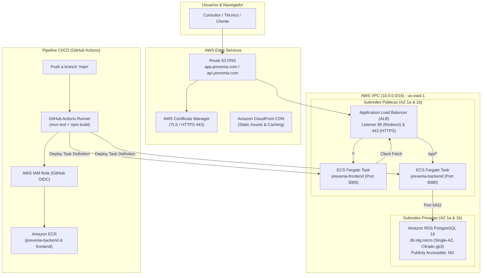

# PREVENIA — Guía de Despliegue en AWS y CI/CD (v0.1)

---

## 1. Arquitectura de Despliegue



---

## 2. Parámetros y Secretos en AWS SSM Parameter Store

En lugar de almacenar credenciales en texto plano o pagar por secretos en AWS Secrets Manager, PREVENIA utiliza **SSM Parameter Store (Standard SecureString)**:

| Nombre del Parámetro SSM | Tipo | Descripción | Ejemplo / Formato |
| :--- | :--- | :--- | :--- |
| `/prevenia/prod/db/host` | String | Endpoint de Amazon RDS | `prevenia-prod-db.xxx.us-east-1.rds.amazonaws.com` |
| `/prevenia/prod/db/port` | String | Puerto PostgreSQL | `5432` |
| `/prevenia/prod/db/name` | String | Nombre de la base de datos | `prevenia` |
| `/prevenia/prod/db/username` | String | Usuario administrador de la BD | `prevenia_admin` |
| `/prevenia/prod/db/password` | SecureString | Contraseña segura de la BD | *(Generada aleatoriamente)* |
| `/prevenia/prod/jwt/secret` | SecureString | Clave criptográfica HMAC-SHA256 (64 chars) | *(Generada con OpenSSL / CryptGen)* |
| `/prevenia/prod/cors/allowed-origins` | String | Orígenes autorizados por CORS | `https://app.prevenia.com` |

---

## 3. Configuración de Seguridad en AWS (Paso a Paso)

### 3.1. Cuenta Root & MFA
1. Iniciar sesión en la consola de AWS con la cuenta Root.
2. Ir a **IAM** → **My Security Credentials** → **Multi-factor authentication (MFA)**.
3. Asignar un dispositivo virtual MFA (Google Authenticator, Authy, etc.).

### 3.2. Usuario Administrador IAM (Principio de Menor Privilegio)
1. Crear un usuario IAM (ej. `prevenia-devops-admin`).
2. Asignar pertenencia al grupo `Administrators` o adjuntar política `AdministratorAccess`.
3. Activar MFA para este usuario.
4. Generar **Access Keys** únicamente para la CLI local del desarrollador (nunca en repositorios).

### 3.3. Configuración de GitHub Actions mediante OIDC (Sin Credenciales Permanentes)
1. Crear un **OpenID Connect (OIDC) Identity Provider** en IAM:
   - Provider URL: `https://token.actions.githubusercontent.com`
   - Audience: `sts.amazonaws.com`
2. Crear un rol IAM `github-actions-prevenia-deploy-role` con Trust Policy restringida al repositorio:
   ```json
   {
     "Version": "2012-10-17",
     "Statement": [
       {
         "Effect": "Allow",
         "Principal": {
           "Federated": "arn:aws:iam::<ACCOUNT_ID>:oidc-provider/token.actions.githubusercontent.com"
         },
         "Action": "sts:AssumeRoleWithWebIdentity",
         "Condition": {
           "StringEquals": {
             "token.actions.githubusercontent.com:aud": "sts.amazonaws.com"
           },
           "StringLike": {
             "token.actions.githubusercontent.com:sub": "repo:<GITHUB_USER_OR_ORG>/<REPO_NAME>:*"
           }
         }
       }
     ]
   }
   ```

---

## 4. Estrategia de Bootstrap del Primer Administrador

En producción no existen usuarios demo. Para dar de alta a la primera organización y al primer `CONSULTANT_ADMIN` de forma segura:

### Procedimiento Recomendado: Script de Bootstrap Controlado
1. Conectarse a la base de datos de producción mediante un túnel SSH/Bastion o una tarea ECS temporal (`aws ecs run-task`).
2. Ejecutar un script SQL de inicialización con password previamente hasheado con BCrypt:
   ```sql
   -- Insertar primera Organización Oficial
   INSERT INTO organizations (id, name, legal_name, tax_id, email, phone, status, created_at, updated_at)
   VALUES (
       gen_random_uuid(),
       'Consultora Principal H&S',
       'Consultora H&S S.A.',
       '30-00000000-0',
       'admin@consultoraprincipal.com',
       '+54 11 0000-0000',
       'ACTIVE',
       CURRENT_TIMESTAMP,
       CURRENT_TIMESTAMP
   );

   -- Insertar primer Administrador de Consultora (Password seguro generado)
   INSERT INTO users (id, organization_id, first_name, last_name, email, password_hash, role, status, created_at, updated_at)
   VALUES (
       gen_random_uuid(),
       (SELECT id FROM organizations WHERE email = 'admin@consultoraprincipal.com'),
       'Admin',
       'Principal',
       'admin@consultoraprincipal.com',
       '$2a$10$XXXXXXXXXXXXXXXXXXXXXXXXXXXXXXXXXXXXXXXXXXXXXXXXXXXXXXXXX',
       'CONSULTANT_ADMIN',
       'ACTIVE',
       CURRENT_TIMESTAMP,
       CURRENT_TIMESTAMP
   );
   ```
3. A partir de este momento, el administrador inicia sesión normalmente en `https://app.prevenia.com/login` y administra técnicos, empresas y vencimientos desde la interfaz.
