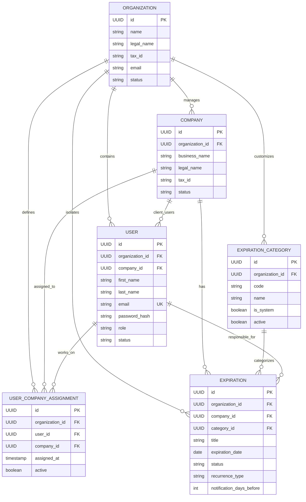

# PREVENIA — Modelo de Dominio (v0.2 — Día 2)

## 1. Visión General del Dominio
El dominio de **PREVENIA** modela la operativa de consultoras de Higiene y Seguridad Laboral que administran el cumplimiento normativo de múltiples empresas clientes.

---

## 2. Entidades Fundacionales (Día 2)

### 2.1 Organization (Consultora de Higiene y Seguridad)
Representa la entidad raíz del inquilino (Tenant).
* **Campos**:
  * `id` (UUID): Identificador único global.
  * `name` (String, Obligatorio): Nombre comercial o fantasía (ej: "Seguridad Integral Córdoba").
  * `legal_name` (String): Razón social legal.
  * `tax_id` (String): Identificación fiscal (CUIT / RUT / NIF).
  * `email` (String, Obligatorio): Email corporativo de contacto.
  * `phone` (String): Teléfono de contacto.
  * `status` (Enum: `ACTIVE`, `SUSPENDED`, `INACTIVE`).
  * `created_at`, `updated_at` (OffsetDateTime UTC).

### 2.2 User (Usuario del Sistema e Identidad)
Identidad y credenciales dentro de PREVENIA.
* **Campos**:
  * `id` (UUID): Identificador único.
  * `organization_id` (UUID, Nullable solo para `PLATFORM_ADMIN`, Obligatorio para el resto).
  * `company_id` (UUID, Nullable, poblado para usuarios de rol `CLIENT` para asociarlos a su empresa).
  * `first_name` & `last_name` (String, Obligatorios).
  * `email` (String, Obligatorio, Único globalmente).
  * `password_hash` (String, BCrypt): Almacenamiento seguro unidireccional.
  * `external_identity_id` (String, Opcional): Para federación OIDC/Cognito futura.
  * `role` (Enum: `PLATFORM_ADMIN`, `CONSULTANT_ADMIN`, `TECHNICIAN`, `CLIENT`).
  * `status` (Enum: `ACTIVE`, `INACTIVE`, `BLOCKED`).

### 2.3 Company (Empresa Cliente)
Representa a una empresa atendida por la consultora (ej: "Banco Macro", "Andreani").
* **Campos**:
  * `id` (UUID): Identificador único.
  * `organization_id` (UUID, Obligatorio): Organización dueña del registro.
  * `business_name` (String, Obligatorio): Nombre de fantasía.
  * `legal_name` (String): Razón social.
  * `tax_id` (String): CUIT de la empresa cliente.
  * `address`, `city`, `province`, `country` (String).
  * `email`, `phone` (String).
  * `status` (Enum: `ACTIVE`, `INACTIVE`, `ARCHIVED`).

### 2.4 UserCompanyAssignment (Asignación Técnico → Empresa)
Asociación granular que define qué técnicos atienden a qué empresas.
* **Campos**:
  * `id` (UUID): Identificador único.
  * `organization_id` (UUID, Obligatorio): Tenant para indexación y queries compuestas.
  * `user_id` (UUID, Obligatorio): Técnico asignado (debe tener rol `TECHNICIAN`).
  * `company_id` (UUID, Obligatorio): Empresa asignada.
  * `assigned_at` (Timestamp UTC).
  * `active` (Boolean): Bandera de estado activo/inactivo (soporta histórico de desasignaciones).
* **Restricciones de Negocio**:
  * Solo se pueden asignar usuarios con rol `TECHNICIAN`.
  * El usuario y la empresa deben pertenecer a la misma `Organization`.
  * No se permite duplicar una asignación activa.

---

## 3. Matriz de Permisos Detallada (Permissions Matrix)

| Acción / Caso de Uso | PLATFORM_ADMIN | CONSULTANT_ADMIN | TECHNICIAN | CLIENT |
|---|:---:|:---:|:---:|:---:|
| **Login (`POST /auth/login`)** | ✅ Sí | ✅ Sí | ✅ Sí | ✅ Sí |
| **Listar Organizaciones (`GET /organizations`)** | ✅ Todas | ❌ 403 | ❌ 403 | ❌ 403 |
| **Ver Organización (`GET /organizations/{id}`)** | ✅ Cualquier Org | ✅ Solo su Org | ❌ 403 | ❌ 403 |
| **Crear Empresa (`POST /companies`)** | ✅ En cualquier Org | ✅ En su propia Org | ❌ 403 | ❌ 403 |
| **Listar Empresas (`GET /companies`)** | ✅ Todas | ✅ Todas las de su Org | ✅ Solo las asignadas | ✅ Solo su empresa |
| **Ver Detalle Empresa (`GET /companies/{id}`)** | ✅ Cualquier empresa | ✅ Solo de su Org (404 ajenas) | ✅ Solo si asignada (404 no asignadas) | ✅ Solo su empresa (404 otras) |
| **Crear Usuario (`POST /users`)** | ✅ Cualquier rol/org | ✅ Solo en su Org (no PLATFORM_ADMIN) | ❌ 403 | ❌ 403 |
| **Listar Usuarios (`GET /users`)** | ✅ Todos | ✅ Solo de su Org | ❌ 403 | ❌ 403 |
| **Asignar Técnico (`POST /companies/{id}/technicians/{uId}`)** | ✅ Sí | ✅ Solo en su Org | ❌ 403 | ❌ 403 |
| **Desasignar Técnico (`DELETE /companies/{id}/technicians/{uId}`)** | ✅ Sí | ✅ Solo en su Org | ❌ 403 | ❌ 403 |
| **Listar Asignaciones (`GET /companies/{id}/technicians`)** | ✅ Sí | ✅ Solo en su Org | ❌ 403 | ❌ 403 |

---

## 4. Estrategia de Vencimientos (Base para Día 3)

### 4.1 Categorías de Vencimiento (`ExpirationCategory`)
* `MATAFUEGOS`, `CAPACITACION`, `ART`, `VISITA_TECNICA`, `ASCENSOR`, `AUTOELEVADOR`, `SEGURO`, `MEDICION`, `DOCUMENTACION`, `PLAN_EVACUACION`, `OTRO`.

### 4.2 Lógica de Estados: Operacional vs. Temporal
1. **Estado Operativo (Persistido)**:
   * `PENDING`: Obligación abierta.
   * `COMPLETED`: Obligación cumplida.
   * `CANCELLED`: Obligación anulada.
2. **Estado Temporal (Calculado en tiempo de ejecución)**:
   * `EXPIRED` (Vencido): `expirationDate < today`.
   * `URGENT` (Urgente): `expirationDate <= today + 7 days`.
   * `UPCOMING` (Próximo): `expirationDate <= today + notificationDaysBefore`.
   * `VALID` (Vigente): `expirationDate > today + notificationDaysBefore`.
