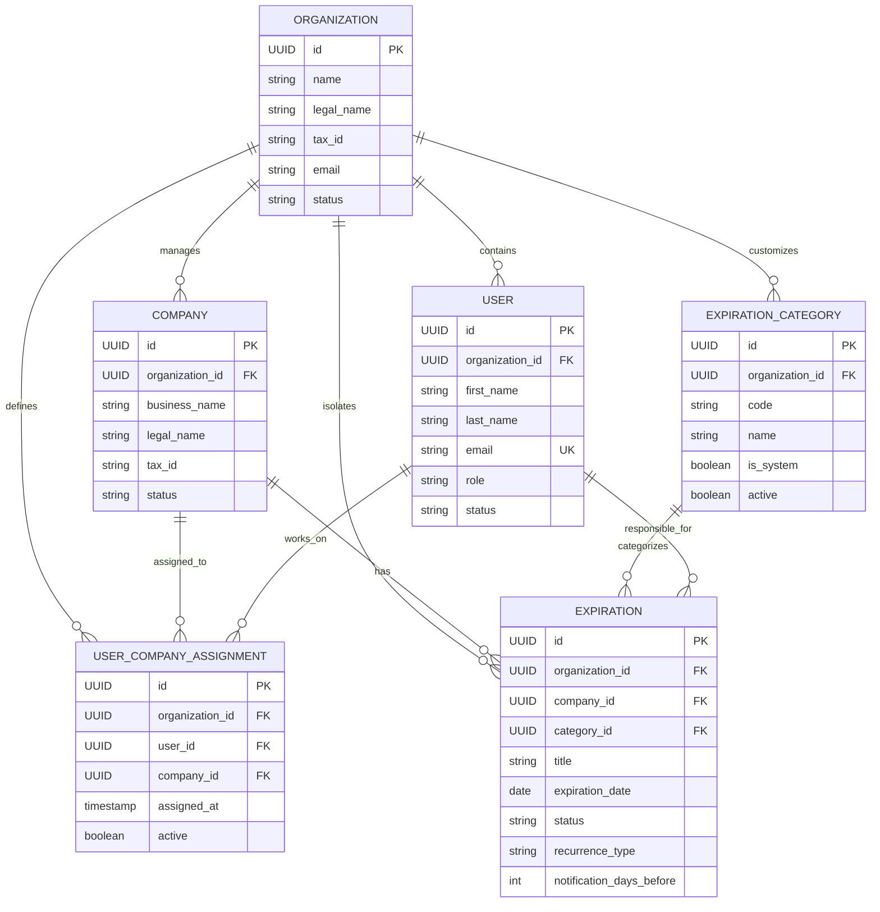

# PREVENIA — Modelo de Dominio (v0.1)

## 1. Visión General del Dominio
El dominio de **PREVENIA** modela la operativa de consultoras de Higiene y Seguridad Laboral que administran el cumplimiento normativo de múltiples empresas clientes.

---

## 2. Entidades Fundacionales (Implementadas en Día 1)

### 2.1 Organization (Consultora de Higiene y Seguridad)
Representa la entidad raíz del inquilino (Tenant).
* **Campos clave**:
  * `id` (UUID): Identificador único global.
  * `name` (String, Obligatorio): Nombre comercial o fantasía (ej: "Seguridad Integral Córdoba").
  * `legal_name` (String): Razón social legal.
  * `tax_id` (String): Identificación fiscal (CUIT / RUT / NIF).
  * `email` (String, Obligatorio): Email corporativo de contacto.
  * `phone` (String): Teléfono de contacto.
  * `status` (Enum: `ACTIVE`, `SUSPENDED`, `INACTIVE`).

### 2.2 User (Usuario del Sistema)
Identidad y credenciales dentro de PREVENIA.
* **Campos clave**:
  * `id` (UUID): Identificador único.
  * `organization_id` (UUID, Opcional para `PLATFORM_ADMIN`, Obligatorio para el resto).
  * `first_name` & `last_name` (String, Obligatorios).
  * `email` (String, Obligatorio, Único globalmente).
  * `password_hash` / `external_identity_id` (String): Soporte dual para autenticación local (BCrypt) o federada (Cognito / Auth0).
  * `role` (Enum: `PLATFORM_ADMIN`, `CONSULTANT_ADMIN`, `TECHNICIAN`, `CLIENT`).
  * `status` (Enum: `ACTIVE`, `INACTIVE`, `BLOCKED`).

### 2.3 Company (Empresa Cliente)
Representa a una empresa atendida por la consultora (ej: "Banco Macro", "Andreani").
* **Campos clave**:
  * `id` (UUID): Identificador único.
  * `organization_id` (UUID, Obligatorio): Organización dueña del registro.
  * `business_name` (String, Obligatorio): Nombre de fantasía.
  * `legal_name` (String): Razón social.
  * `tax_id` (String): CUIT de la empresa cliente.
  * `address`, `city`, `province`, `country` (String).
  * `email`, `phone` (String).
  * `status` (Enum: `ACTIVE`, `INACTIVE`, `ARCHIVED`).

### 2.4 UserCompanyAssignment (Asignación Técnico → Empresa)
Asociación granular que define qué técnicos atienden a qué empresas.
* **Campos clave**:
  * `id` (UUID): Identificador único.
  * `organization_id` (UUID, Obligatorio).
  * `user_id` (UUID, Obligatorio): Técnico asignado.
  * `company_id` (UUID, Obligatorio): Empresa asignada.
  * `assigned_at` (Timestamp UTC).
  * `active` (Boolean): Bandera de estado activo/inactivo.
* **Restricción**: Clave única compuesta `(organization_id, user_id, company_id)`.

### 2.5 ExpirationCategory (Categoría de Vencimiento)
Catálogo tipificado de obligaciones.
* **Estrategia híbrida**: Categorías estándar del sistema (`organization_id = NULL`) y categorías personalizadas por consultora (`organization_id = UUID`).
* **Categorías estándar iniciales**:
  1. `MATAFUEGOS` (Matafuegos y Extintores)
  2. `CAPACITACION` (Capacitaciones de Personal)
  3. `ART` (ART y Cobertura)
  4. `VISITA_TECNICA` (Visitas Técnicas)
  5. `ASCENSOR` (Ascensores y Montacargas)
  6. `AUTOELEVADOR` (Autoelevadores y Maquinaria)
  7. `SEGURO` (Seguros y Pólizas)
  8. `MEDICION` (Mediciones y Protocolos: PAT, Ruido, Iluminación)
  9. `DOCUMENTACION` (Habilitaciones y Legal)
  10. `PLAN_EVACUACION` (Plan de Evacuación y Simulacros)
  11. `OTRO` (Otras Obligaciones)

### 2.6 Expiration (Vencimiento / Obligación)
Entidad central y corazón del negocio. Modela de manera genérica y flexible cualquier compromiso sujeto a una fecha límite.
* **Campos clave**:
  * `id` (UUID): Identificador único.
  * `organization_id` (UUID): Tenant.
  * `company_id` (UUID): Empresa a la que pertenece la obligación.
  * `category_id` (UUID): Categoría asociada.
  * `title` (String, Obligatorio): Descripción corta del vencimiento (ej: "Recarga Anual Extintores Nave 1").
  * `description` (Text): Detalle normativo o alcance.
  * `issue_date` (Date, Opcional): Fecha de emisión o última renovación.
  * `expiration_date` (Date, Obligatorio): Fecha límite o de expiración.
  * `status` (Enum Operativo: `PENDING`, `COMPLETED`, `CANCELLED`).
  * `responsible_user_id` (UUID, Opcional): Técnico o responsable asignado.
  * `recurrence_type` (Enum: `NONE`, `MONTHLY`, `QUARTERLY`, `SEMIANNUAL`, `YEARLY`, `CUSTOM`).
  * `notification_days_before` (Int, Default 30): Días de anticipación para disparar alertas.
  * `notes` (Text): Observaciones técnicas.

---

## 3. Lógica de Estados: Operacional vs. Temporal

Para evitar inconsistencias de datos (donde un registro dice "VIGENTE" en la base de datos pero el reloj ya cruzó la medianoche), se separa:

1. **Estado Operativo (Persistido en DB)**:
   * `PENDING`: La obligación está abierta y pendiente de resolución/renovación.
   * `COMPLETED`: La obligación fue cumplida/renovada.
   * `CANCELLED`: La obligación fue anulada o dada de baja.

2. **Estado Temporal (Calculado en Capa de Aplicación / DTO)**:
   * Si `status == PENDING`:
     * `EXPIRED` (Vencido): `expirationDate < today`.
     * `URGENT` (Urgente): `expirationDate <= today + 7 days`.
     * `UPCOMING` (Próximo a Vencer): `expirationDate <= today + notificationDaysBefore`.
     * `VALID` (Vigente): `expirationDate > today + notificationDaysBefore`.

---

## 4. Entidades Planificadas para Días Posteriores

1. **`ExpirationDocument`**: Documentación técnica adjunta (PDFs de certificados de carga, informes de auditoría, comprobantes de seguro).
2. **`NotificationRule`**: Reglas de notificación configurables por empresa o categoría (alertas por email, SMS o WhatsApp 60, 30, 15 y 5 días antes).
3. **`Notification`**: Registro de historial de notificaciones enviadas y leídas.
4. **`AuditLog`**: Pista de auditoría inmutable de cambios (quién modificó una fecha de vencimiento, cuándo y desde qué IP).
