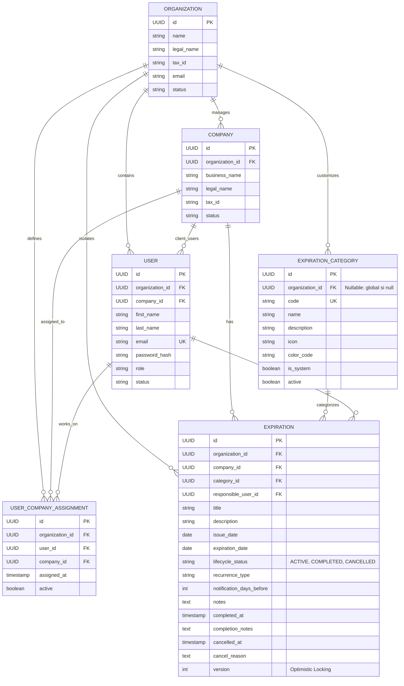

# PREVENIA — Modelo de Dominio (v0.3 — Día 3)

## 1. Visión General del Dominio
El dominio de **PREVENIA** modela la operativa de consultoras de Higiene y Seguridad Laboral que administran el cumplimiento normativo de múltiples empresas clientes.

El **Core de Vencimientos** constituye el corazón comercial del producto, permitiendo registrar obligaciones legales/técnicas, asociar responsables, rastrear el ciclo de vida administrativo y clasificar temporalmente la urgencia de cada plazo en tiempo de ejecución.

---

## 2. Entidades Fundacionales y de Seguridad

### 2.1 Organization (Consultora de Higiene y Seguridad)
Representa la entidad raíz del inquilino (Tenant).
* **Campos**:
  * `id` (UUID): Identificador único global.
  * `name` (String, Obligatorio): Nombre comercial (ej: "Seguridad Integral Córdoba").
  * `legal_name` (String): Razón social legal.
  * `tax_id` (String): Identificación fiscal (CUIT / RUT / NIF).
  * `email` (String, Obligatorio): Email corporativo.
  * `phone` (String): Teléfono.
  * `status` (Enum: `ACTIVE`, `SUSPENDED`, `INACTIVE`).
  * `created_at`, `updated_at` (OffsetDateTime UTC).

### 2.2 User (Usuario del Sistema e Identidad)
* **Campos**:
  * `id` (UUID): Identificador único.
  * `organization_id` (UUID, Nullable solo para `PLATFORM_ADMIN`).
  * `company_id` (UUID, Nullable, poblado para usuarios de rol `CLIENT`).
  * `first_name` & `last_name` (String, Obligatorios).
  * `email` (String, Obligatorio, Único globalmente).
  * `password_hash` (String, BCrypt).
  * `role` (Enum: `PLATFORM_ADMIN`, `CONSULTANT_ADMIN`, `TECHNICIAN`, `CLIENT`).
  * `status` (Enum: `ACTIVE`, `INACTIVE`, `BLOCKED`).

### 2.3 Company (Empresa Cliente)
* **Campos**:
  * `id` (UUID): Identificador único.
  * `organization_id` (UUID, Obligatorio): Tenant al que pertenece.
  * `business_name` (String, Obligatorio): Nombre comercial.
  * `legal_name` (String): Razón social.
  * `tax_id` (String): CUIT de la empresa cliente.
  * `status` (Enum: `ACTIVE`, `INACTIVE`, `ARCHIVED`).

### 2.4 UserCompanyAssignment (Asignación Técnico → Empresa)
Asociación granular que define qué técnicos atienden a qué empresas.

---

## 3. Core de Vencimientos (Día 3)

### 3.1 ExpirationCategory (Categoría de Vencimiento)
Permite catalogar las obligaciones legales y operativas.
* **Estrategia Global vs Tenant (Opción C)**:
  * **Categorías Globales**: `organization_id = NULL` e `is_system = TRUE`. Visibles para todas las consultoras de la plataforma, inmutables por tenants.
  * **Categorías Personalizadas**: `organization_id = UUID` e `is_system = FALSE`. Creadas por una consultora específica para sus requerimientos particulares.
* **Campos**:
  * `id` (UUID): Identificador único.
  * `organization_id` (UUID, Nullable).
  * `code` (String, Obligatorio, Normalizado uppercase/trim).
  * `name` (String, Obligatorio).
  * `description` (String, Opcional).
  * `icon` / `color_code` (String, Opcional).
  * `is_system` (Boolean): Indica si es provista por el sistema.
  * `active` (Boolean): Soft toggle para habilitar/deshabilitar.
* **Catálogo Global Inicial (Seed V1/V3)**:
  1. `MATAFUEGOS` (Matafuegos y Extintores)
  2. `CAPACITACION` (Capacitaciones y Formación)
  3. `ART` (Seguros y Cobertura ART)
  4. `VISITA_TECNICA` (Visitas Técnicas Periódicas)
  5. `ASCENSORES` (Ascensores y Montacargas)
  6. `AUTOELEVADORES` (Autoelevadores y Maquinaria)
  7. `SEGUROS` (Pólizas de Seguros Generales)
  8. `MEDICIONES` (Mediciones de Puesta a Tierra, Ruido e Iluminación)
  9. `DOCUMENTACION` (Habilitaciones y Planos de Evacuación)
  10. `OTROS` (Otras Obligaciones)

### 3.2 Expiration (Obligación / Vencimiento)
Representa una obligación técnica, legal o reglamentaria de una empresa cliente.
* **Campos**:
  * `id` (UUID): PK.
  * `organization_id` (UUID, Obligatorio): Tenant de la consultora.
  * `company_id` (UUID, Obligatorio): Empresa cliente sujeta a la obligación.
  * `category_id` (UUID, Obligatorio): Categoría de la obligación (global o del tenant).
  * `responsible_user_id` (UUID, Opcional): Técnico o Administrador responsable (debe pertenecer al mismo tenant y tener asignación a la empresa si es técnico).
  * `title` (VARCHAR(200), Obligatorio).
  * `description` (TEXT, Opcional).
  * `issue_date` (LocalDate, Opcional): Fecha de emisión/inspección anterior. `issue_date <= expiration_date`.
  * `expiration_date` (LocalDate, Obligatorio): Día calendario en el que vence la obligación.
  * `lifecycle_status` (Enum: `ACTIVE`, `COMPLETED`, `CANCELLED`): Estado administrativo persistido en DB.
  * `recurrence_type` (Enum: `NONE`, `MONTHLY`, `QUARTERLY`, `SEMIANNUAL`, `YEARLY`, `CUSTOM`).
  * `notification_days_before` (INT, Default 30).
  * `notes` (TEXT, Opcional).
  * `completed_at` (OffsetDateTime UTC, Opcional).
  * `completion_notes` (TEXT, Opcional).
  * `cancelled_at` (OffsetDateTime UTC, Opcional).
  * `cancel_reason` (TEXT, Opcional).
  * `version` (INT, Default 0): Control de concurrencia optimista (`@Version`).
  * `created_at`, `updated_at` (OffsetDateTime UTC).

---

## 4. Clasificación de Estados: Lifecycle vs. Deadline

### 4.1 Estado Administrativo Persistente (`ExpirationLifecycleStatus`)
Almacenado físicamente en la columna `status` de la tabla `expirations`:
* `ACTIVE`: Obligación vigente o en curso que debe ser gestionada.
* `COMPLETED`: Obligación cumplida y ejecutada (ej: recarga realizada, capacitación dictada).
* `CANCELLED`: Obligación dada de baja o anulada por error de carga / baja de equipo.

### 4.2 Estado Temporal Dinámico (`ExpirationDeadlineStatus`)
**No se almacena en la base de datos**. Se calcula al vuelo en cada consulta mediante el `ExpirationDeadlineClassifier` inyectando un `java.time.Clock`:

| Deadline Status | Condición Temporal | Días Restantes (`daysUntilExpiration`) | Significado de Negocio |
|---|---|---|---|
| `EXPIRED` | `expirationDate < today` | `< 0` | Vencido. Plazo legal expirado. |
| `URGENT` | `today <= expirationDate <= today + 7d` | `0 a 7` | Urgente. Vence hoy o en los próximos 7 días inclusive. |
| `UPCOMING` | `today + 8d <= expirationDate <= today + 30d` | `8 a 30` | Próximo. En ventana de gestión mensual. |
| `CURRENT` | `expirationDate > today + 30d` | `> 30` | Vigente. Margen holgado. |

* **Regla de Precedencia**:
  * Si `lifecycleStatus == COMPLETED` o `lifecycleStatus == CANCELLED` → `deadlineStatus = NULL` (el frontend no lo muestra como vencido ni urgente).
  * Si `lifecycleStatus == ACTIVE` → se evalúa la regla temporal correspondiente.

---

## 5. Matriz de Permisos Actualizada (Día 3)

| Caso de Uso / Endpoint | PLATFORM_ADMIN | CONSULTANT_ADMIN | TECHNICIAN | CLIENT |
|---|:---:|:---:|:---:|:---:|
| **Listar Vencimientos (`GET /expirations`)** | ✅ Todos | ✅ De su Org | ✅ De empresas asignadas | ✅ Solo de su empresa |
| **Próximos Vencimientos (`GET /expirations/upcoming`)** | ✅ Todos | ✅ De su Org | ✅ De empresas asignadas | ✅ Solo de su empresa |
| **Vencidos (`GET /expirations/expired`)** | ✅ Todos | ✅ De su Org | ✅ De empresas asignadas | ✅ Solo de su empresa |
| **Vencimientos de Empresa (`GET /companies/{id}/expirations`)** | ✅ Cualquier empresa | ✅ Solo de su Org | ✅ Solo si asignada | ✅ Solo su empresa |
| **Ver Detalle Vencimiento (`GET /expirations/{id}`)** | ✅ Cualquiera | ✅ Solo de su Org (404 ajenas) | ✅ Solo si asignada (404 otras) | ✅ Solo su empresa (404 otras) |
| **Crear Vencimiento (`POST /expirations`)** | ✅ En cualquier Org/Company | ✅ En su Org | ✅ En empresas asignadas | ❌ 403 Forbidden |
| **Editar Vencimiento (`PUT /expirations/{id}`)** | ✅ Sí | ✅ Solo de su Org | ✅ Solo en empresas asignadas | ❌ 403 Forbidden |
| **Completar Vencimiento (`POST /expirations/{id}/complete`)** | ✅ Sí | ✅ Solo de su Org | ✅ Solo en empresas asignadas | ❌ 403 Forbidden |
| **Cancelar Vencimiento (`POST /expirations/{id}/cancel`)** | ✅ Sí | ✅ Solo de su Org | ✅ Solo en empresas asignadas | ❌ 403 Forbidden |
| **Eliminar Vencimiento (`DELETE /expirations/{id}`)** | ✅ Sí | ✅ Solo de su Org | ✅ Solo en empresas asignadas | ❌ 403 Forbidden |
| **Listar Categorías (`GET /expiration-categories`)** | ✅ Todas | ✅ Globales + Org | ✅ Globales + Org | ✅ Globales + Org |
| **Crear Categoría (`POST /expiration-categories`)** | ✅ Global o Tenant | ✅ En su Org | ❌ 403 Forbidden | ❌ 403 Forbidden |
